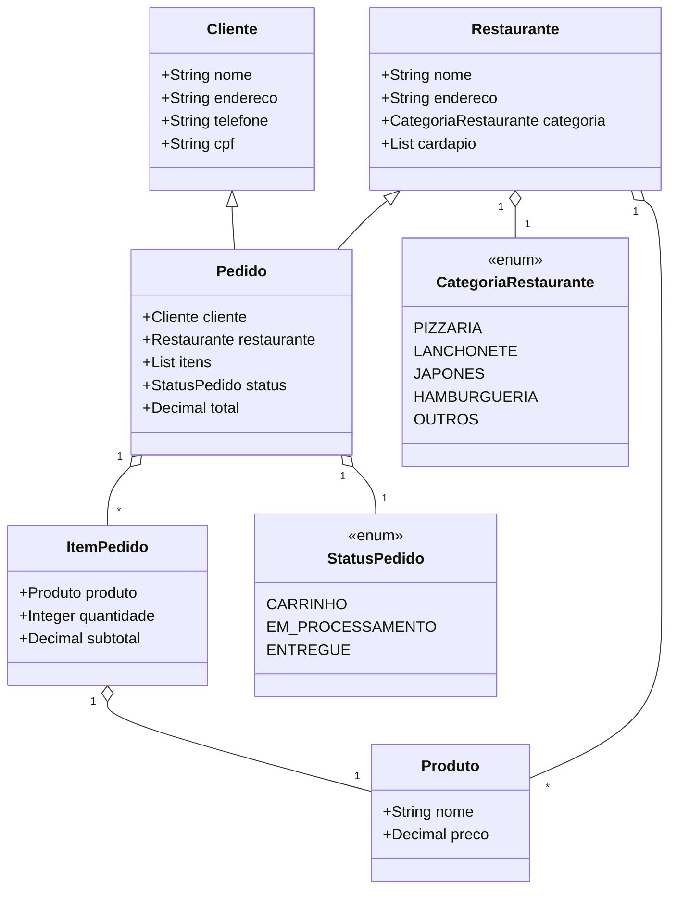

## Resumo do Projeto AppDelivery

Este projeto é uma aplicação de delivery desenvolvida em Salesforce Apex, simulando o fluxo de pedidos entre clientes e restaurantes. As principais entidades são:

- **Cliente**: Dados pessoais e endereço.
- **Restaurante**: Informações, categoria e cardápio (lista de produtos).
- **Produto**: Nome e preço.
- **ItemPedido**: Produto, quantidade e subtotal.
- **Pedido**: Cliente, restaurante, lista de itens, status e total.
- **CategoriaRestaurante**: Enum de tipos de restaurante.
- **StatusPedido**: Enum de status do pedido.

O fluxo principal envolve clientes realizando pedidos em restaurantes, adicionando produtos ao carrinho, confirmando e acompanhando o status do pedido.

---

## UML das Classes

Diagrama das principais entidades e seus relacionamentos:

---

## Acoplamentos e Análise SOLID

- **Acoplamento**: O acoplamento entre as classes está principalmente entre Pedido, ItemPedido, Produto, Restaurante e Cliente. Pedido depende de Restaurante e Cliente, e contém uma lista de ItemPedido, que por sua vez depende de Produto.
- **Possíveis melhorias para SOLID**:
    - **Single Responsibility**: Separar regras de negócio (ex: cálculo de subtotal, confirmação de pedido) em serviços específicos, evitando que classes de domínio tenham múltiplas responsabilidades.
    - **Open/Closed**: Permitir extensão de tipos de restaurante ou status sem modificar enums, usando Strategy ou State.
    - **Liskov Substitution**: Garantir que métodos de manipulação de itens/pedidos não quebrem contratos esperados.
    - **Interface Segregation**: Criar interfaces para operações de cardápio, pedido e cliente, facilitando testes e manutenção.
    - **Dependency Inversion**: Utilizar injeção de dependências para serviços de persistência ou regras de negócio, desacoplando as classes principais.

---

## Sugestões de Refatoração

- Extrair lógica de confirmação e manipulação de pedidos para uma classe de serviço (ex: PedidoService).
- Utilizar interfaces para abstrair operações de restaurante e pedido.
- Implementar padrões como Strategy para cálculo de descontos ou taxas de entrega.
- Separar enums em classes de estado para facilitar extensões futuras.

---

# Salesforce DX Project: Next Steps

Now that you’ve created a Salesforce DX project, what’s next? Here are some documentation resources to get you started.

## How Do You Plan to Deploy Your Changes?

Do you want to deploy a set of changes, or create a self-contained application? Choose a [development model](https://developer.salesforce.com/tools/vscode/en/user-guide/development-models).

## Configure Your Salesforce DX Project

The `sfdx-project.json` file contains useful configuration information for your project. See [Salesforce DX Project Configuration](https://developer.salesforce.com/docs/atlas.en-us.sfdx_dev.meta/sfdx_dev/sfdx_dev_ws_config.htm) in the _Salesforce DX Developer Guide_ for details about this file.

## Read All About It

- [Salesforce Extensions Documentation](https://developer.salesforce.com/tools/vscode/)
- [Salesforce CLI Setup Guide](https://developer.salesforce.com/docs/atlas.en-us.sfdx_setup.meta/sfdx_setup/sfdx_setup_intro.htm)
- [Salesforce DX Developer Guide](https://developer.salesforce.com/docs/atlas.en-us.sfdx_dev.meta/sfdx_dev/sfdx_dev_intro.htm)
- [Salesforce CLI Command Reference](https://developer.salesforce.com/docs/atlas.en-us.sfdx_cli_reference.meta/sfdx_cli_reference/cli_reference.htm)